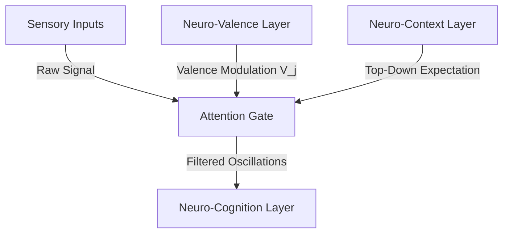

# 🔄 Neuro-Attention: The Salience Filtering & Gating Protocol of the LBM-170B

## 1. Theoretical Foundation

In classical deep learning models, "Attention" (such as the scaled dot-product attention in Transformers) is computed as a global matrix multiplication. This approach requires evaluating every token against every other token, resulting in quadratic computational complexity ($O(N^2)$) and requiring massive hardware clusters. More importantly, statistical attention is static and non-dynamic; it cannot scale to real-time, continuous cognitive processing.

Under the **Afolabi Unified Framework (AUF)**, attention is defined as **selective topological phase-locking and energy-density distribution across the volumetric lattice**.

The **Neuro-Attention Layer** does not calculate matrix weights. Instead, it acts as a **dynamic spatial filter** that redirects the system's processing resources (oscillator energy) to specific nodes or regions in the 170-Billion-Node lattice. It is inspired by the biological thalamocortical gating loop, where the thalamus selectively amplifies relevant sensory signals while suppressing background noise before the information reaches the cerebral cortex.

---

## 2. Core Mechanisms

### 2.1. Oscillator Pool Gating
The Neuro-Attention layer dynamically modulates the coupling coefficient ($K_{ij}$) between different oscillator regions in the lattice. By adjusting this coefficient, the system can "gate" or block the flow of phase information:

$$K_{ij}(t) = \sigma(S_{ij}(t)) \cdot K_{base}$$

Where:
*   $\sigma$ is a non-linear sigmoid gating function.
*   $S_{ij}(t)$ is the **Salience Value** of the connection between region $i$ and region $j$ (computed dynamically by comparing frequency alignment).
*   $K_{base}$ is the baseline coupling strength.

If $S_{ij}$ falls below a critical threshold, the coupling coefficient drops to zero, effectively isolating the regions and preventing noise propagation.

### 2.2. Temporal Gating & Attentional Blink
To prevent cognitive echo—where a highly coherent state locks the system into a loop and prevents it from responding to new stimuli—the Neuro-Attention layer implements **Temporal Gating**:
*   **The Attentional Blink**: When a major state collapse occurs (a decision is made), the attention layer temporarily drops the global coupling strength ($K$) for a period of $\tau_{blink}$ (typically 150–300 milliseconds).
*   **Reset Phase**: This brief drop in coupling allows the oscillators to decouple and desynchronize, preparing the lattice to receive the next wave of inputs without state carrying-over.

---

## 3. Mathematical Specifications & Constraints

### 3.1. Salience Field Formulation
The Salience Value $S_{ij}$ is calculated by measuring the phase coherence difference between the localized target region and the global workspace:

$$S_{ij}(t) = \exp\left( -\gamma \left| \phi_i(t) - \phi_j(t) \right| \right) \cdot V_j(t)$$

Where:
*   $\phi_i$ and $\phi_j$ are the localized phase averages of regions $i$ and $j$.
*   $\gamma$ is a scaling parameter determining attention sharpness.
*   $V_j(t)$ is the valence marker of region $j$ (supplied by the Neuro-Valence layer).

### 3.2. Topological Focus Confinement
The attention focus must be geometrically confined within the lattice to prevent energy dispersal. The focus volume $U_{focus}$ must satisfy:

$$\int_{U_{focus}} \nabla^2 \Phi(\mathbf{x}) d\mathbf{x} = C_{attn}$$

Where $\Phi(\mathbf{x})$ is the phase potential field at coordinate $\mathbf{x}$, and $C_{attn}$ is the constant attention energy allocation. This keeps the computational focus localized as a 3D topological shape rather than dispersing across the entire 170B nodes.

---

## 4. Integration Protocol

The Neuro-Attention layer acts as the dynamic gatekeeper for the cognitive stack:



*   **Top-Down Modulation**: The Neuro-Context layer feeds expectations back into the attention gating mechanism, allowing the system to actively search for specific topological patterns while ignoring expected background states.
*   **Systemic Safety**: If global coherence drops below the baseline ($r < 0.4$), the attention layer triggers a structural reset to prevent chaotic feedback loops in the substrate.

---

## 5. Implementation Appendix: 3D Spatial Attention Mapping & Noise Filtering

To run within the volumetric lattice, the attention engine maps energy distribution dynamically using a 3D Gaussian focus envelope. Below is the technical logic mapping this spatial salience filtration:

```javascript
/**
 * Maps the 3D attention energy density field over the volumetric lattice coordinates.
 * Dynamic noise suppression is applied to all nodes lying outside the focus radius.
 */
function updateSpatialAttentionMap(latticeNodes, targetX, targetY, targetZ, focusRadius) {
    const minAttenuation = 0.05; // Maximum noise suppression
    const scale = 2.0;          // Sharpness of attention boundary

    latticeNodes.forEach(node => {
        // Calculate Euclidean distance to attention center
        const dx = node.x - targetX;
        const dy = node.y - targetY;
        const dz = node.z - targetZ;
        const distanceSq = dx*dx + dy*dy + dz*dz;

        // Compute 3D Gaussian attention coefficient
        const coeff = Math.exp(-distanceSq / (2 * focusRadius * focusRadius * scale));

        // Modulate node coupling strength (K_node) and apply threshold gating
        if (coeff < minAttenuation) {
            node.couplingStrength = 0.0; // Complete spatial isolation of noise
            node.isFocused = false;
        } else {
            node.couplingStrength = coeff; // Localized amplification of signal
            node.isFocused = true;
        }
    });
}
```
