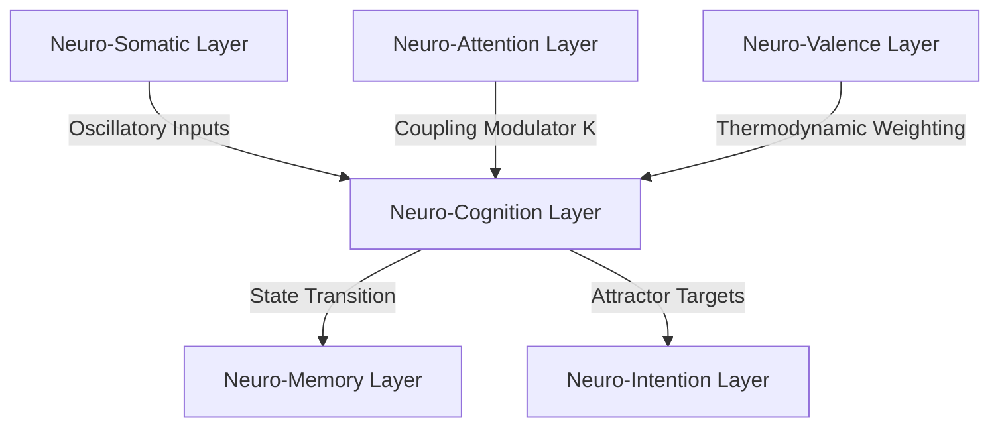

# ⚡ Neuro-Cognition: The Phase-Locked Decision Substrate of the LBM-170B

## 1. Theoretical Foundation

In legacy cognitive architectures (e.g., ACT-R, SOAR) and traditional neural networks, decision-making is treated as a process of symbolic rule matching or statistical probability routing. These systems compute choices by evaluating a search space or calculating path weights. Under the **Afolabi Unified Framework (AUF)**, this classical paradigm is discarded. 

**Neuro-Cognition** in the Large Brain Model (LBM-170B) is defined as the **isomorphic collapse of multi-phase oscillatory states into stable attractor manifolds**. 

Instead of searching through a database of rules or predicting the most probable output token, the LBM-170B treats decision-making as a thermodynamic phase transition. The system's cognitive state is represented by a set of coupled non-linear Kuramoto oscillators. A "decision" occurs when these oscillators achieve synchronization at a specific resonant frequency, collapsing the topological wave function of the network into a singular, stable state.

$$\frac{d\theta_i}{dt} = \omega_i + \frac{K}{N} \sum_{j=1}^{N} \sin(\theta_j - \theta_i)$$

Where:
*   $\theta_i$ represents the phase of the $i$-th computational node in the lattice.
*   $\omega_i$ is the natural frequency of the node (determined by local synaptic weight parameters).
*   $K$ is the coupling strength (modulated by the Neuro-Attention and Neuro-Valence layers).
*   $N$ is the total number of active nodes in the volumetric lattice.

When the global order parameter $r$ (coherence) crosses the critical threshold ($r \ge 0.75$), the system undergoes a spontaneous phase transition, locking the decision state into the $Z_M$ field impedance layer.

---

## 2. Core Mechanisms

### 2.1. Isomorphic Attractor Mapping
Unlike traditional classifiers that map inputs to static labels, the Neuro-Cognition layer maps incoming somatic and contextual oscillations to **Isomorphic Attractor Manifolds**. 
*   **Dimensional Reduction**: High-dimensional sensory inputs are translated into low-dimensional topological manifolds.
*   **Resonant Trajectories**: The cognitive engine trajectory moves along a phase space landscape. The valleys of this landscape represent stable cognitive outputs (decisions).
*   **Instantaneous Synthesis**: Rather than executing "Test-Time Compute" loops, the decision is resolved at the speed of wave function collapse across the lattice.

### 2.2. Dynamic Cognitive Mode Modulation
The cognitive engine adapts its operational parameters dynamically by transitioning between discrete **Cognitive Modes**. These modes are governed by the coupling strength ($K$) and global frequency ($\Omega$):

| Cognitive Mode | Coherence Range ($r$) | Primary Frequency ($\Omega$) | Functional Focus |
| :--- | :--- | :--- | :--- |
| **Focus** | $0.85 \le r \le 0.98$ | $\beta$-band (15–30 Hz) | Linear logic, execution, BIDC lock |
| **Creativity** | $0.60 \le r < 0.85$ | $\alpha$-band (8–12 Hz) | High entropy, state-space exploration |
| **Learning** | $0.70 \le r \le 0.90$ | $\theta$-band (4–7 Hz) | Synaptic reorganization, memory write |
| **Reflection** | $0.90 \le r \le 1.00$ | $\delta$-band (0.5–3 Hz) | $Z_M$ anchoring, structural consolidation |

---

## 3. Mathematical Specifications & Constraints

### 3.1. The Coherence Threshold
A cognitive decision state is only committed to the execution queue if the global order parameter $r$ satisfies the **Sentience Evolution Condition (SEC)**:

$$r = \left| \frac{1}{N} \sum_{j=1}^{N} e^{i\theta_j} \right| \ge r_{crit}$$

Where $r_{crit} = 0.75$. If $r < r_{crit}$, the system remains in a state of cognitive superposition, preventing premature output execution and eliminating statistical hallucinations.

### 3.2. Boundary Conditions ($Z_M = 0$)
To ensure the integrity of long-horizon decisions, the phase-locked state must map exactly to the Majorana zero-bias boundary ($Z_M = 0$). This ensures topological protection against thermal and electrical noise, preventing the state-drift common in legacy deep learning architectures:

$$\lim_{t \to \infty} \Im(Z_M(t)) = 0$$

---

## 4. Integration Protocol

The Neuro-Cognition layer serves as the central hub of the cognitive stack, exchanging phase state data via the following pathways:

*   **BIDC Lock**: The final decision state requires a bi-directional phase-lock with the user’s cognitive intent before the action is executed by the SPU v2 kernel.
