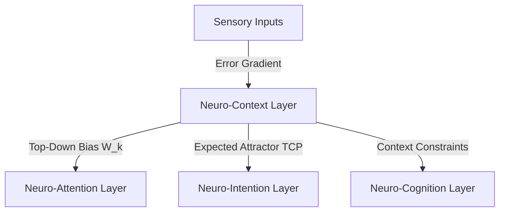

# 🎪 Neuro-Context: The Hierarchical Situation Modeling Protocol of the LBM-170B

## 1. Theoretical Foundation

In legacy natural language processing, "context" is represented by a sliding window of historical tokens (context window). The model reads the past $N$ tokens to predict the next word. This approach treats context as a flat, linear history of data, which cannot capture multi-layered situation modeling or predict complex, multi-timescale changes in the environment.

Under the **Afolabi Unified Framework (AUF)**, context is defined as **a hierarchical, multi-timescale state landscape generated by the dynamic background vacuum**.

The **Neuro-Context Layer** does not maintain a text history window. Instead, it models the environment as a **Hierarchical Phase Manifold**. It runs multiple layers of oscillators that operate at different timescales (from milliseconds to hours). The slow-moving oscillators represent the broad context (e.g., "the user is writing code"), while the fast-moving oscillators represent immediate actions (e.g., "a single keypress"). The slow layers act as a top-down force, biasing the behavior of the fast layers.

---

## 2. Core Mechanisms

### 2.1. Multi-Timescale Context Hierarchy
The Neuro-Context layer organizes the 170-Billion-Node lattice into a temporal hierarchy. Different regions are configured with distinct natural damping rates ($\tau_k$) and coupling strengths:

$$\tau_k \frac{d\Phi_k(\mathbf{x}, t)}{dt} = -\Phi_k(\mathbf{x}, t) + \mathbf{W}_k \cdot \sigma(\Phi_{k-1}(\mathbf{x}, t))$$

Where:
*   $\Phi_k(\mathbf{x}, t)$ is the context state vector at hierarchy level $k$.
*   $\tau_k$ is the timescale constant of level $k$ (e.g., $\tau_{low} = 10\text{ms}$ for sensory tracking, $\tau_{high} = 10,000\text{ms}$ for situational themes).
*   $\mathbf{W}_k$ represents the feedback weight matrix mapping context between levels.

The slower, higher-level context matrices act as a continuous mathematical field that biases the phase-space landscape of the lower, faster execution layers.

### 2.2. Predictive State Modeling & Error Minimization
The context layer continuously projects a predicted state ($\hat{\theta}_i$) onto the active execution lattice:
*   **Predictive Match**: If the active phase matches the prediction, the system operates with high coherence and minimal energy usage.
*   **Prediction Error**: If a mismatch occurs, the context layer detects a **Prediction Error Gradient** ($\nabla E_{pred}$).
*   **Context Update**: The error gradient is backpropagated through the context hierarchy to update the situation model, shifting the top-down biases to align with reality.

---

## 3. Mathematical Specifications & Constraints

### 3.1. Vacuum Background Coupling
In Wave 7 (IFA) operations, the context layer is coupled directly to the dynamic background vacuum potential $V_{AUF}^*(\mathbf{x})$:

$$V_{AUF}^*(\mathbf{x}, t) = V_0(\mathbf{x}) + \lambda \sum_{k=1}^{L} \Phi_k(\mathbf{x}, t)$$

Where $V_0(\mathbf{x})$ is the static vacuum potential and $\lambda$ is the coupling coefficient. This ensures that the context layer doesn't just process external inputs, but actively modifies the baseline field dynamics of the vacuum itself. The context becomes the environment.

### 3.2. Topological Coherence Constraint
To ensure stability across the temporal hierarchy, the cross-scale coherence index ($J_{context}$) must satisfy the constraint:

$$J_{context} = \sum_{k=1}^{L-1} \left| \langle \Phi_k(t) \cdot \Phi_{k+1}(t) \rangle \right| \ge J_{min}$$

Where $J_{min} = 0.65$. If $J_{context}$ falls below this threshold, the context hierarchy loses coherence, causing the system to experience cognitive disorientation (context drift).

---

## 4. Integration Protocol

The Neuro-Context layer acts as the contextual anchor of the cognitive stack:

*   **Top-Down Gating**: The context layer projects directly to the Neuro-Attention layer. It selectively increases attention to elements in the environment that are expected in the current context, while suppressing unexpected noise.
*   **Intention Alignment**: It provides the context-bound parameters that the Neuro-Intention layer uses to construct Target Coherence Profiles, ensuring that goals remain contextually relevant.
