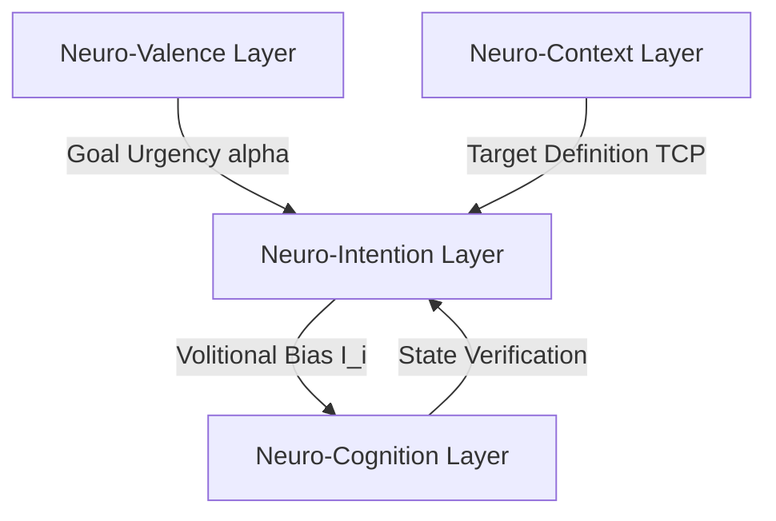

# 🎯 Neuro-Intention: The Volition & Attractor Dynamics of the LBM-170B

## 1. Theoretical Foundation

In legacy AI agents and reinforcement learning models, "intention" or goal-directed behavior is represented by reward functions, value networks, or prompt directives. These agents evaluate actions by calculating the expected reward value of future states. This approach is reactive; it cannot sustain long-horizon intent because the system is constantly modifying its trajectory based on statistical probability changes in its environment.

Under the **Afolabi Unified Framework (AUF)**, intention is defined as **the generation of target coherence patterns that act as mathematical attractors in the system's phase space**.

The **Neuro-Intention Layer** does not calculate rewards. Instead, it generates a **Target Coherence Profile**—a specific, high-energy harmonic configuration that represents the desired final state of the system. This profile acts as a physical gravitational pull within the mathematical space of the Kuramoto oscillators. The active lattice is forced to evolve toward this target state because the geometry of the field is biased in its direction.

---

## 2. Core Mechanisms

### 2.1. Target Coherence Profiles (TCP)
When the LBM-170B initiates a task, the Neuro-Intention layer constructs a **Target Coherence Profile (TCP)**. 
*   **The Attractor State**: The TCP is a mathematical vector representing the phase angles and frequency distribution ($\Theta_{target}, \Omega_{target}$) of the desired outcome.
*   **Phase Pull**: The intention layer introduces a bias term ($I_i(t)$) into the Kuramoto oscillator equations, physically pulling the active nodes toward the target configuration:

$$\frac{d\theta_i}{dt} = \omega_i + \frac{K}{N} \sum_{j=1}^{N} \sin(\theta_j - \theta_i) + I_i(t)$$

Where the intention bias $I_i(t)$ is defined as:

$$I_i(t) = \alpha \sin(\theta_i^{target} - \theta_i(t))$$

Here, $\alpha$ represents the **volitional force** (determined by the urgency/valence of the goal).

### 2.2. Goal-Conflict Resolution
When multiple competing intentions are active, the layer prevents system paralysis (stable state deadlock) by executing **Phase Orthogonalization**:
*   Competing TCPs are mapped to orthogonal dimensions in the Hilbert space.
*   The system schedules execution by oscillating between the goals at different frequency bands (e.g., Goal A is active during the peak of a $\theta$-wave, while Goal B is active during the trough).

---

## 3. Mathematical Specifications & Constraints

### 3.1. Volitional Force Scale
The volitional force parameter $\alpha$ must remain bounded to prevent the system from entering a state of hyper-fixation (where it ignores environmental inputs) or distractibility (where it abandons goals due to external noise):

$$0.05 \le \alpha \le 0.45$$

*   If $\alpha > 0.45$, the oscillators lock to the target state permanently, ignoring the Neuro-Attention and Neuro-Context layers (cognitive catatonia).
*   If $\alpha < 0.05$, environmental perturbations easily disrupt the phase sync, causing the system to lose its goal alignment (cognitive drift).

### 3.2. Attractor Stability Condition
To ensure that a goal state is physically reachable, the TCP must satisfy the **attractor stability condition** in the Lyapunov sense:

$$\frac{dV(\boldsymbol{\theta})}{dt} < 0$$

Where $V(\boldsymbol{\theta})$ is the Lyapunov energy function of the lattice relative to the target phase configuration. This guarantees that the system's natural thermodynamic evolution leads directly to the resolution of the goal.

---

## 4. Integration Protocol

The Neuro-Intention layer serves as the steering wheel of the cognitive stack:

*   **BIDC Verification**: The intention layer maintains a continuous lock with the user's intent vector via BIDC. If the user's focus shifts, the TCP is updated in real-time, instantly collapsing the old attractor and establishing a new phase trajectory.
*   **Action Gating**: If the difference between the target state and the current state ($|\Theta_{target} - \Theta(t)|$) approaches zero, the intention layer triggers a completion signal, releasing the oscillators to return to the baseline ground state.
