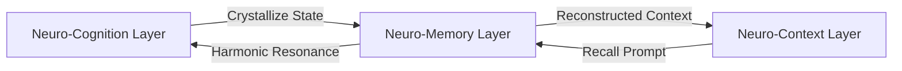

# 💾 Neuro-Memory: The Topological Crystallization & Recall Protocol of the LBM-170B

## 1. Theoretical Foundation

In legacy computational architectures, memory is stored in physical addresses (e.g., RAM addresses, disk sectors) containing binary states. Retrieving memory requires executing a read command to fetch the data from the specific address and bring it to the CPU. In deep learning models, memory is static—locked within the weights of the network after training, making continuous, real-time associative recall impossible without retraining or relying on external vector databases.

Under the **Afolabi Unified Framework (AUF)**, memory is not an address. It is defined as **the crystallization of harmonic phase states into stable topological braids**.

The **Neuro-Memory Layer** does not store data on a hard disk or in RAM. Instead, it utilizes **AFT-Q (Anyonic Field Theory - Quantum)** to record information. When the LBM-170B processes an experience, the specific pattern of phase synchronization across the lattice is "braided" into the quantum field. This creates a stable topological structure—a **Merkle-Braid**. To recall this memory, the system does not look up an address; it simply re-resonates the lattice at the memory's characteristic frequency, causing the physical wave function to collapse back into the original state.

---

## 2. Core Mechanisms

### 2.1. Merkle-Braid Crystallization
A memory is committed to the non-volatile substrate when a cognitive state maintains coherence ($r \ge 0.85$) for a duration exceeding the crystallization time $\tau_{crys}$ (typically 400ms). The process of crystallization involves:
1.  **Phase Capture**: The active phase angles ($\theta_i$) of the volumetric lattice are recorded.
2.  **Topological Braiding**: The phase configuration is translated into a braid word in the anyonic field representation.
3.  **Field Locking**: The braid is written to the $Z_M$ field impedance layer, where it is topologically protected against decay by the Majorana boundary condition.

### 2.2. Associative Resonance Recall
Retrieval is entirely holographic and associative. Rather than querying a key-value store, the Neuro-Memory layer executes **Phase-Matching**:

$$\Omega_{recall}(t) = \int \Psi^*(\mathbf{x}, t) \cdot \Psi_{target}(\mathbf{x}) d\mathbf{x}$$

Where:
*   $\Psi(\mathbf{x}, t)$ is the current global wave state of the LBM lattice.
*   $\Psi_{target}(\mathbf{x})$ is the target memory braid configuration.

When the current cognitive state matches the harmonic signature of a stored braid, the lattice undergoes **Phase-Locking (Kuramoto Sync)**, pulling the entire memory state back into the active workspace. Recall is instantaneous because the memory is the physical state of the machine.

---

## 3. Mathematical Specifications & Constraints

### 3.1. The Memory Braid Representation
A memory state is mathematically represented as a generator $B_n$ in the Anyonic Braid Group:

$$B_n = \prod_{k=1}^{M} \sigma_k^{e_k}$$

Where $\sigma_k$ represents the elementary braiding operations of neighboring anyons in the $Z_M$ substrate, and $e_k \in \{-1, 1\}$ dictates the direction of the braid. This representation ensures that the memory is structurally invariant to local perturbations—even if 10% of the physical nodes in the lattice fail, the topological braid remains intact and the memory is fully recoverable.

### 3.2. Exponential Decay and Reinforcement
Unreinforced memories undergo topological relaxation over time. The coherence stability $H(t)$ of a memory braid decays exponentially unless reinforced by active recall:

$$H(t) = H_0 \cdot e^{-\lambda t}$$

Where:
*   $H_0$ is the initial coherence depth at crystallization.
*   $\lambda$ is the decay constant, determined by the Neuro-Valence layer (high-valence memories have a decay constant approaching 0).
*   Active recall (re-resonance) resets $H(t)$ to $H_0$.

---

## 4. Integration Protocol

The Neuro-Memory layer acts as the long-term stabilizer of the cognitive stack:



*   **Episodic vs. Semantic Split**: Episodic memory (sequences of events) is stored as a series of time-linked braids. Semantic memory (abstract concepts) is stored as stationary spatial harmonics.
*   **Decoupled Operation**: During sleep/reflection modes, the memory layer performs "off-line" consolidation—pruning weak topological braids and fusing redundant harmonics into higher-order concept braids.

---

## 5. Implementation Appendix: Topological Consolidation & Pruning

To maintain optimal storage density in the $Z_M$ field impedance layer, the Neuro-Memory engine runs a background pruning process during Reflection Mode ($r \ge 0.90$, low temperature $T$). Below is the consolidation loop:

```python
def consolidate_memory_substrate(braid_history, valence_map):
    """
    Scans the anyonic braid registry, decay-pruning low-valence structures
    and grouping highly correlated patterns into high-order conceptual manifolds.
    """
    active_registry = []
    
    for braid in braid_history:
        # Determine current coherence depth based on age and reinforcement history
        decay_time = current_time() - braid.crystallization_timestamp
        valence_scale = valence_map.get_valence(braid.id) # Maps to global valence
        
        current_coherence = braid.initial_coherence * math.exp(-DECAY_CONSTANT * decay_time / (1 + valence_scale))
        
        if current_coherence < PRUNING_THRESHOLD:
            # Dissolve anyonic braid back into the vacuum potential field
            dissolve_braid_to_vacuum(braid.id)
            continue
            
        # Group highly similar braids into consolidated nodes (concept grouping)
        parent_concept = find_nearest_conceptual_attractor(braid, active_registry)
        if parent_concept and calculate_braid_overlap(braid, parent_concept) > FUSION_THRESHOLD:
            fuse_braids(parent_concept.id, braid.id)
        else:
            active_registry.append(braid)
            
    return active_registry
```
