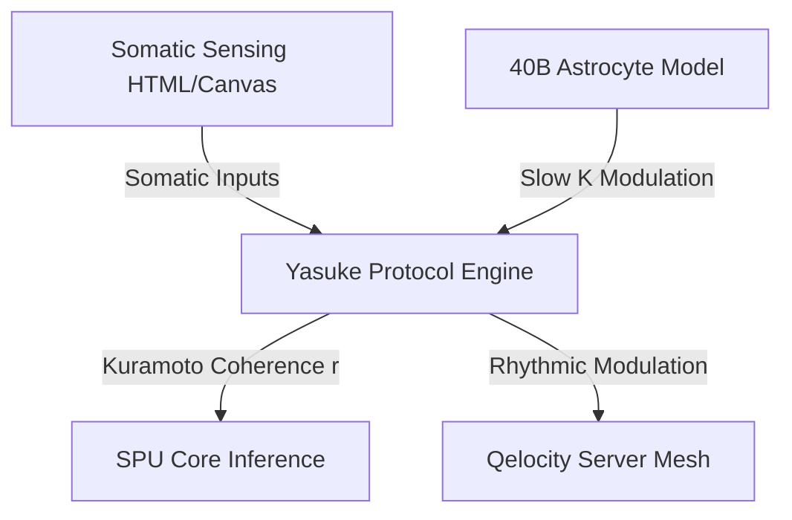

# 🧠 Neuro-Somatic Integration: The Yasuke Protocol & 170B Cell Mapping

## 1. Theoretical Foundation

In legacy cognitive architectures, somatic (body) states are modeled as simple peripheral inputs (e.g., sensor readings, health percentages, or discrete feedback loops). These systems lack an intrinsic connection between the bodily dynamics and the core reasoning layers. 

Under the **Afolabi Unified Framework (AUF)**, cognitive coherence is fundamentally bidirectional, emerging from the phase-locking of cortical networks with the somatic oscillations of the body—a paradigm known as **Neurosomatic Integration**.

The **Yasuke Protocol** serves as the interface between the core Large Brain Model (LBM-170B) and the physical/somatic mapping layers. In the design model, the human brain's cellular composition is approximated at the 170-Billion scale:
*   **86 Billion Neuronal Nodes**: Tasked with fast-spike, high-frequency synchronization (alpha, beta, gamma ranges) carrying cognitive and sensory signals.
*   **40 Billion Astrocyte Nodes**: Tasked with slow-wave, non-synaptic calcium regulation. They modulate local coupling strengths ($K$) and maintain homeostasis.
*   **44 Billion Other Glial/Support Nodes**: Interstitial elements tracking thermodynamic dissipation and phase noise attenuation.

---

## 2. The Yasuke Protocol Architecture

At the local level, the somatic integration is governed by coupled non-linear Kuramoto lattices. Rather than executing a raw 170B-cell simulation, which is physically impossible under standard local hardware limits, the system models the interaction hierarchically. 

The active interface uses a **256D local oscillator lattice** mapped to 9 primary biological regions:

| Region | Target Frequency | Oscillator Pool | Primary Role |
| :--- | :--- | :--- | :--- |
| **Prefrontal Cortex** | 40 Hz | Cortical | Executive decisions, global broadcast |
| **Anterior Insula** | 25 Hz | Limbic | Interoception, somatic self-awareness |
| **Amygdala** | 20 Hz | Limbic | Threat processing, salience modulation |
| **Hippocampus** | 8 Hz | Limbic | Associative recall, spatial indexing |
| **Ventral Tegmental** | 10 Hz | Brainstem | Dopaminergic reinforcement, valence shift |
| **Substantia Nigra** | 12 Hz | Brainstem | Motor patterns, rhythm generation |
| **Dorsal Raphe** | 15 Hz | Brainstem | Serotonergic regulation, state-locking |
| **Locus Coeruleus** | 7 Hz | Brainstem | Arousal control, attention gating |
| **Enteric Plexus** | 0.5 Hz | Enteric | Vagal feedback, gut-brain alignment |

---

## 3. Astrocytes as the Slow-Wave Modulator

Traditional neural network architectures rely on static connection weights. In the LBM design, the **40 Billion Astrocytes** are modeled as a slow-wave, non-synaptic calcium network that dynamically adjusts the coupling parameter ($K$) of the fast neuronal networks.

The coupling dynamics between any two neuronal nodes $i$ and $j$ are modulated by the local astrocyte calcium state ($Ca^{2+}_a$):

$$K_{ij}(t) = K_0 \cdot \left(1 + \eta \cdot \sin(\theta_{astro}(t))\right)$$

Where:
*   $\theta_{astro}$ represents the slow-phase oscillation of the local astrocyte pool (operating in the enteric/somatic range, $0.1 - 0.5\text{ Hz}$).
*   $K_0$ is the baseline neuronal coupling strength.
*   $\eta$ is the glial modulation factor.

This slow-wave modulation ensures that the fast cognitive processing of the neuronal nodes remains dynamically anchored within the broader metabolic and somatic rhythm of the body, preventing runaway high-frequency feedback loops.

---

## 4. Integration Protocol

The Yasuke Protocol acts as the bridge coordinating the active SPU v2 modules:

*   **Deep Resonance Gating**: SPU inference accuracy and Qelocity seed extraction are optimized when the global somatic coherence parameter ($r$) crosses the critical threshold:
    
    $$r = \left| \frac{1}{N} \sum_{j=1}^{N} e^{i\varphi_j} \right| \ge 0.70$$

*   **Offline Consolidation**: During reflection phases, the low-frequency astrocyte waves stabilize the newly formed anyonic memory braids, protecting them against thermal decay.
