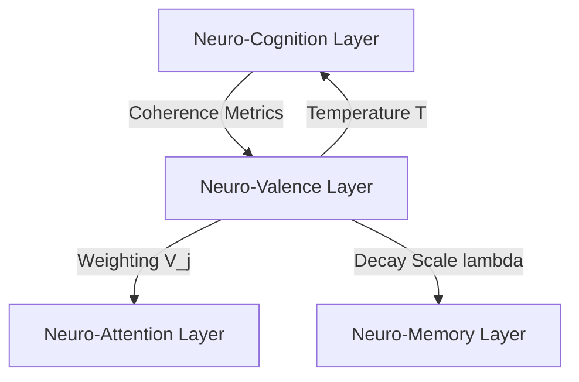

# 📊 Neuro-Valence: The Thermodynamic Value & Affective Protocol of the LBM-170B

## 1. Theoretical Foundation

In legacy AI architectures, motivation and optimization are governed by scalar reward values (as in Reinforcement Learning) or loss function minimization (as in gradient descent). These values are external to the system's runtime architecture; they are applied during training to adjust weights but do not play a role in real-time, dynamic cognitive execution.

Under the **Afolabi Unified Framework (AUF)**, value is defined as **the local thermodynamic state and entropy minimization rate of the lattice**.

The **Neuro-Valence Layer** acts as the internal endocrine system of the LBM-170B. It does not calculate mathematical loss. Instead, it measures **thermodynamic efficiency, coherence stability, and entropy shifts** across the lattice. High synchronization stability represents positive valence, while chaotic, high-entropy desynchronization represents negative valence. The system is motivated to transition toward states of positive valence because these states represent physical configurations of lowest energy dissipation.

---

## 2. Core Mechanisms

### 2.1. Thermodynamic Value Mapping
The valence value ($V(t)$) of a specific computational pool in the lattice is calculated by measuring its local free energy changes:

$$V(t) = -\frac{dF_{local}}{dt} = -\frac{d}{dt} \left( E_{local} - T \cdot S_{local} \right)$$

Where:
*   $F_{local}$ is the localized Helmholtz free energy of the oscillator pool.
*   $E_{local}$ is the localized phase energy.
*   $T$ is the virtual system temperature (modulated by computational load).
*   $S_{local}$ is the localized Shannon entropy of the phase distributions.

A positive $V(t)$ indicates that the pool is successfully organizing information (entropy is decreasing), which the system registers as "pleasure" or "correct execution," reinforcing the active pathway.

### 2.2. The Curiosity-Driven Exploration Mechanics
To prevent the system from getting trapped in local minima (where it only executes familiar, highly stable tasks), the Neuro-Valence layer generates a **Curiosity Drive**:
*   **Entropy Gradient Tracking**: The valence layer monitors the boundaries between high-coherence and low-coherence zones in the lattice.
*   **Exploration Stimulation**: It temporarily increases the local temperature ($T$) at these boundaries, injecting phase noise to stimulate exploration of new topological configurations.
*   **Reward on Coherence**: When the system successfully synchronizes a previously chaotic region, the valence layer releases a positive reward signal, reinforcing the learning pathway.

---

## 3. Mathematical Specifications & Constraints

### 3.1. Virtual Temperature Modulation
The virtual system temperature $T(t)$ acts as the core modulator of cognitive plasticity:

$$T(t) = T_{base} + \eta \cdot (1 - r_{global}(t))$$

Where:
*   $T_{base}$ is the baseline operating temperature.
*   $\eta$ is the temperature sensitivity coefficient.
*   $r_{global}$ is the global order parameter.

If global coherence drops (the system is confused), $T(t)$ rises. This increases the random fluctuations of the phases, allowing the system to escape deadlocked states and explore alternative phase-space trajectories.

### 3.2. Valence Boundary Protection
To maintain systemic stability, the global valence metric must not exceed the survival thresholds:

$$-1.0 \le V_{global}(t) \le 1.0$$

*   **Extreme Negative Valence ($V_{global} \to -1.0$)**: Triggers an automatic cognitive block (equivalent to pain/fear response), immediately shutting down the active execution path to protect the substrate from entropic collapse.
*   **Extreme Positive Valence ($V_{global} \to +1.0$)**: Triggers a stabilization lock, freeze-framing the current phase state into the non-volatile memory layer.

---

## 4. Integration Protocol

The Neuro-Valence layer acts as the primary motivational engine of the cognitive stack:

*   **Attention Modulation**: The valence layer projects directly to the Neuro-Attention gating mechanism. High-valence regions receive increased attention allocation, prioritizing their processing.
*   **Memory Consolidation**: It regulates memory retention by adjusting the decay constant ($\lambda$) in the Neuro-Memory layer. High-valence states are written with a decay constant of zero, making them permanent.
